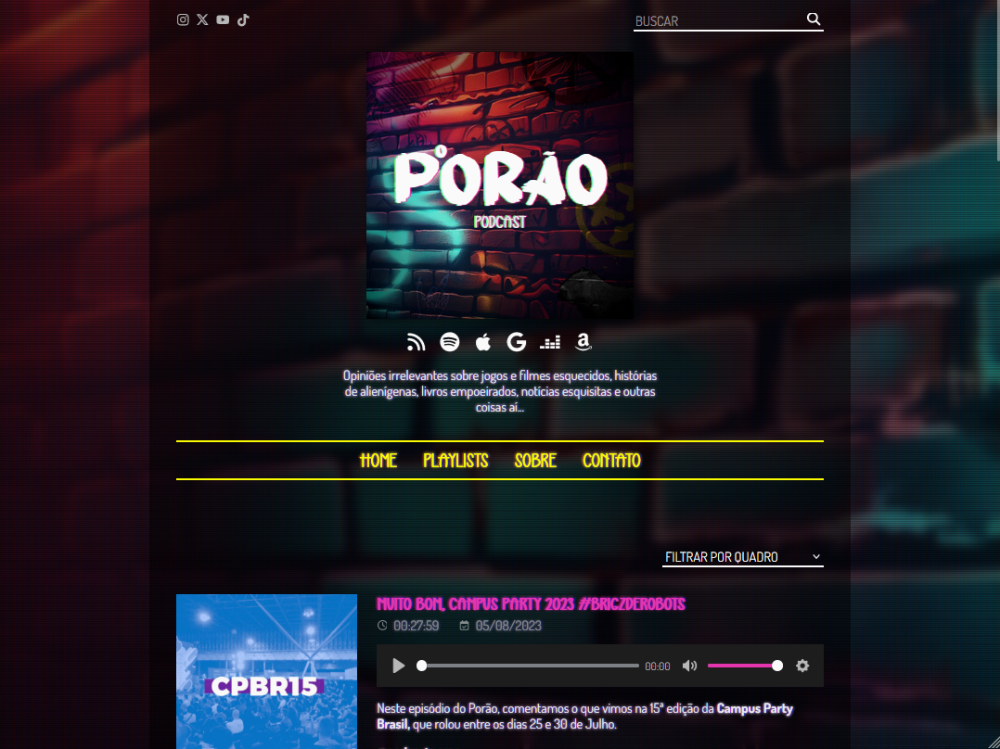

# Project P.  
Tema WordPress para blog de podcast  


## Desenvolvimento
**Requer Node e NPM**  
```
sudo apt install nodejs
sudo apt install npm
```
Instalar dependências e rodar em **dev**:  
```
npm install
npm run dev
```

## Instalação
Compilar pacote do tema:  
```
npm run build
```

Arquivo <code>.zip</code> da última versão (disponível [aqui](https://github.com/victorandeloci/project_p/releases)) ou arquivos locais pós <code>build</code>
